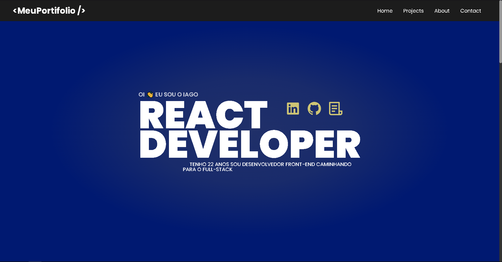

# MeuPortifolio


>Primeira ideia do portifólio pelo [figma](https://www.figma.com/community/file/1310574702820657348/portifolio-iago):


>Tela home atual do portifólio:


> Esse projeto consiste em mostrar as minhas habilidades e projetos dentro do meu portifolio

### Ajustes e melhorias

O projeto ainda está em desenvolvimento e as próximas atualizações serão voltadas nas seguintes tarefas:

- [x] Construção e limpeza do projeto inicial(pasta).
- [x] Fazer o deploy no vercel, para deixar o site pré-preparado.
- [x] Criar as telas(Home, About, Projects e Contact) e os components(Header e footer).
- [x] Realizar a estrutura HTML do site.
- [x] Realizar a estrutura CSS do site.
- [x] Realizar a responsividade da estrutura CSS do site.
- [x] Montar o design dos projetos do site.

## 🌐 Acesso para o MeuPortifolio

Já esta disponível para acesso, foi realizado [deploy no vercel](https://meuportifolio-iago.vercel.app).

## ☕ Usando MeuPortifolio

Para usar MeuPortifolio, siga estas etapas:

```
Ao entrar no site é possível usar a barra de scroll para usufruir de uma experiência maior
```

## 💻 Pré-requisitos

Antes de começar, verifique se você atendeu aos seguintes requisitos:

- Você instalou a versão mais recente de `<linguagem / dependência / requeridos>`
- Você tem uma máquina `<Windows / Linux / Mac>`.

## 🚀 Instalando MeuPortifolio

Para instalar o MeuPortifolio, siga estas etapas:

Linux e macOS:

```
npm install
```
```
npm run dev
```

Windows:

```
npm install
```
```
npm run dev
```

## 📫 Contribuindo para MeuPortifolio

Para contribuir com MeuPortifolio, siga estas etapas:

1. Bifurque este repositório.
2. Crie um branch: `git checkout -b <nome_branch>`.
3. Faça suas alterações e confirme-as: `git commit -m '<mensagem_commit>'`
4. Envie para o branch original: `git push origin <nome_do_projeto> / <local>`
5. Crie a solicitação de pull.

Como alternativa, consulte a documentação do GitHub em [como criar uma solicitação pull](https://help.github.com/en/github/collaborating-with-issues-and-pull-requests/creating-a-pull-request).

## 🤝 Colaboradores

Reponsável deste projeto:

<table>
  <tr>
    <td align="center">
      <a href="https://github.com/iagoslopes" title="Github">
        <br>
        <sub>
          <b>Iago de Souza Lopes</b>
        </sub>
      </a>
    </td>
    <td align="center">
      <a href="https://www.linkedin.com/in/rafael-a-freitas-4a41b2264/" title="LinkedIn">
        <br>
        <sub>
          <b>Rafael Araújo Freitas</b>
        </sub>
      </a>
    </td>
  </tr>
</table>